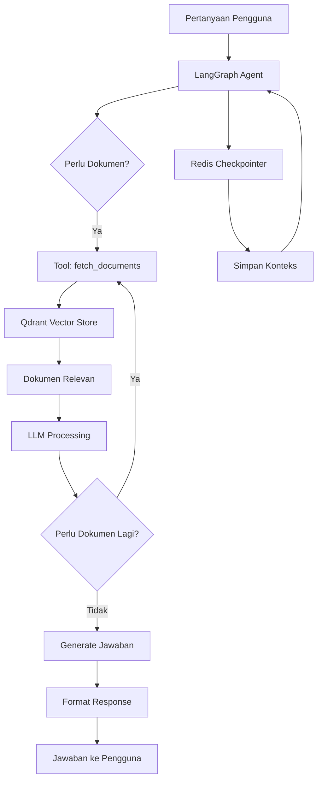
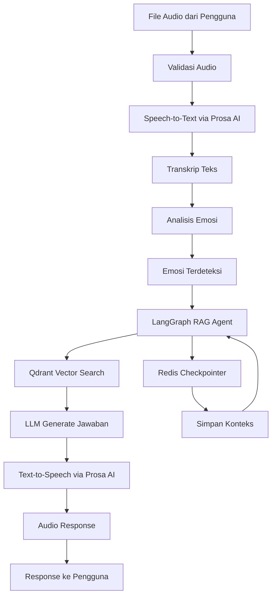

# Panduan Deployment Aplikasi Agentic Chatbot ITB

## Pendahuluan

Dokumentasi ini ditujukan bagi tim DevOps di lingkungan kampus yang bertanggung jawab untuk melakukan deployment aplikasi *Agentic Chatbot* yang dikembangkan untuk Institut Teknologi Bandung (ITB). Aplikasi ini merupakan sistem chatbot cerdas yang memanfaatkan teknologi *Retrieval-Augmented Generation* (RAG) untuk menjawab pertanyaan seputar informasi akademik ITB. Sistem ini dirancang dengan arsitektur yang dapat diskalakan dan siap untuk digunakan dalam lingkungan produksi.

Aplikasi ini tidak hanya mendukung interaksi berbasis teks, tetapi juga memiliki kemampuan untuk memproses input audio melalui *speech-to-text*, menganalisis emosi pengguna, dan menghasilkan respons dalam bentuk audio melalui *text-to-speech*. Semua fitur ini terintegrasi dalam satu sistem yang dapat diakses melalui *REST API* atau antarmuka web berbasis Streamlit.

## Gambaran Umum Aplikasi

Aplikasi *Agentic Chatbot* ITB adalah sistem chatbot yang dirancang khusus untuk menjawab pertanyaan terkait informasi akademik di lingkungan ITB. Sistem ini dibangun menggunakan *framework* Python dengan Flask sebagai *web framework* utama untuk menyediakan *REST API*, dan Streamlit untuk menyediakan antarmuka web yang user-friendly.

Sistem ini bekerja dengan cara mengambil informasi dari basis data vektor yang berisi dokumen-dokumen terkait informasi akademik ITB. Ketika pengguna mengajukan pertanyaan, sistem akan melakukan pencarian semantik di basis data vektor untuk menemukan dokumen-dokumen yang relevan, kemudian menggunakan *Large Language Model* (LLM) untuk menghasilkan jawaban yang kontekstual berdasarkan dokumen-dokumen tersebut.

Salah satu keunggulan sistem ini adalah kemampuannya untuk mempertahankan konteks percakapan. Setiap percakapan memiliki *thread ID* yang unik, dan sistem akan menyimpan riwayat percakapan menggunakan Redis sebagai *checkpointer*. Hal ini memungkinkan chatbot untuk memahami konteks dari pertanyaan-pertanyaan sebelumnya dalam suatu sesi percakapan, sehingga dapat memberikan jawaban yang lebih relevan dan koheren.

Aplikasi ini menyediakan dua *endpoint* utama. *Endpoint* pertama adalah `/v1/chat` yang menerima input berupa teks dan mengembalikan jawaban dalam format teks. *Endpoint* kedua adalah `/v1/audio` yang menerima input berupa file audio, melakukan proses *speech-to-text*, menganalisis emosi pengguna, memproses pertanyaan melalui sistem RAG, dan mengembalikan jawaban dalam bentuk audio yang telah disintesis.

## Arsitektur dan Cara Kerja AI

Arsitektur aplikasi ini dibangun di atas LangGraph, sebuah *framework* yang memungkinkan pembuatan *agent* AI dengan alur kerja yang dapat dikonfigurasi. LangGraph menggunakan konsep *state machine* di mana setiap langkah dalam proses pemrosesan dapat didefinisikan dengan jelas, memungkinkan kontrol yang lebih baik atas alur eksekusi dan memudahkan proses *debugging*.

### Alur Kerja LangGraph untuk RAG Agent

Sistem menggunakan *ReAct agent* pattern yang dibuat melalui fungsi `create_react_agent` dari LangGraph. *ReAct* adalah singkatan dari Reasoning and Acting, yang berarti *agent* dapat melakukan penalaran sambil menggunakan *tools* yang tersedia. Dalam konteks aplikasi ini, *agent* memiliki satu *tool* utama yaitu `fetch_documents` yang digunakan untuk mengambil dokumen dari basis data vektor.

Berikut adalah diagram alur kerja LangGraph untuk proses RAG:



Ketika pengguna mengajukan pertanyaan, sistem akan memulai alur kerja LangGraph. *Agent* akan menerima pesan dari pengguna dan memutuskan apakah perlu mengambil dokumen dari basis data vektor. Jika diperlukan, *agent* akan memanggil *tool* `fetch_documents` dengan *search query* yang telah direformulasi berdasarkan konteks percakapan sebelumnya.

*Tool* `fetch_documents` akan melakukan pencarian semantik di Qdrant *vector store* menggunakan *embedding* dari *search query*. Qdrant akan mengembalikan dokumen-dokumen yang paling relevan berdasarkan kemiripan vektor. Dokumen-dokumen ini kemudian diberikan kepada *LLM* untuk diproses dan dijadikan dasar untuk menghasilkan jawaban.

*Agent* dapat melakukan beberapa iterasi jika diperlukan. Misalnya, jika jawaban awal belum memuaskan atau jika *agent* merasa perlu informasi tambahan, ia dapat memanggil *tool* `fetch_documents` lagi dengan *query* yang berbeda. Proses ini akan berlanjut hingga *agent* yakin bahwa ia memiliki informasi yang cukup untuk memberikan jawaban yang komprehensif.

Selama proses ini, setiap langkah akan disimpan dalam Redis *checkpointer*. *Checkpointer* ini menyimpan *state* dari percakapan, termasuk riwayat pesan dan konteks yang telah dibangun. Ketika pengguna mengajukan pertanyaan lanjutan dalam sesi yang sama, sistem akan memuat konteks sebelumnya dari *checkpointer*, sehingga *agent* dapat memahami referensi ke percakapan sebelumnya.

### Alur Kerja untuk Audio Processing

Untuk *endpoint* `/v1/audio`, alur kerja lebih kompleks karena melibatkan beberapa tahap pemrosesan. Berikut adalah diagram alur kerja lengkap untuk pemrosesan audio:



Proses dimulai ketika pengguna mengunggah file audio. Sistem akan memvalidasi file audio terlebih dahulu untuk memastikan format dan ukuran file sesuai dengan yang diizinkan. Setelah validasi berhasil, file audio akan dikirim ke layanan Prosa AI untuk proses *speech-to-text*.

Prosa AI menggunakan *WebSocket* untuk komunikasi *streaming*, yang memungkinkan proses transkripsi dilakukan secara real-time. Audio dikirim dalam *chunks* ke *WebSocket endpoint*, dan sistem akan menerima *partial transcripts* selama proses berlangsung, serta *final transcript* ketika proses selesai.

Setelah mendapatkan transkrip, sistem akan melakukan analisis emosi. Analisis emosi ini menggunakan layanan eksternal yang dapat menganalisis emosi dari teks dan audio. Emosi yang terdeteksi akan disertakan dalam konteks yang diberikan kepada *RAG agent*, sehingga *agent* dapat menyesuaikan nada dan gaya respons sesuai dengan emosi pengguna.

Transkrip dan emosi kemudian diberikan kepada LangGraph RAG *agent* yang akan memproses pertanyaan sesuai dengan alur yang telah dijelaskan sebelumnya. Setelah *agent* menghasilkan jawaban dalam bentuk teks, jawaban tersebut akan dikirim ke layanan Prosa AI untuk proses *text-to-speech*.

Proses *text-to-speech* juga menggunakan *WebSocket* untuk komunikasi *streaming*. Sistem akan mengirim konfigurasi seperti model suara, format audio, dan *sample rate*, kemudian mengirim teks yang akan disintesis. Prosa AI akan mengembalikan audio yang telah disintesis dalam format yang diminta.

Audio response kemudian dikonversi ke format *hexadecimal* dan dikembalikan kepada pengguna bersama dengan transkrip, jawaban teks, sumber referensi, dan informasi waktu eksekusi untuk setiap tahap pemrosesan.

## Dependensi Eksternal

Aplikasi ini bergantung pada beberapa layanan eksternal yang masing-masing memiliki peran penting dalam fungsionalitas sistem. Memahami dependensi ini sangat penting untuk perencanaan deployment dan troubleshooting.

### OpenAI

OpenAI digunakan untuk dua keperluan utama dalam sistem ini. Pertama, OpenAI menyediakan *embedding model* `text-embedding-3-large` yang digunakan untuk mengonversi dokumen dan *query* menjadi vektor. *Embedding* ini sangat penting untuk proses pencarian semantik di basis data vektor, karena kualitas *embedding* akan menentukan seberapa akurat sistem dapat menemukan dokumen yang relevan.

Kedua, OpenAI juga menyediakan *LLM* `gpt-4o-mini` yang dapat digunakan sebagai *fallback* jika *primary LLM* mengalami masalah. Meskipun dalam konfigurasi saat ini sistem menggunakan OpenRouter sebagai *primary LLM provider*, OpenAI tetap diperlukan untuk *embedding* dan sebagai cadangan.

Untuk menggunakan layanan OpenAI, Anda perlu memiliki *API key* yang valid. *API key* ini harus disimpan dalam variabel lingkungan `OPENAI_API_KEY`. Perlu diperhatikan bahwa penggunaan OpenAI *API* akan dikenakan biaya berdasarkan jumlah *tokens* yang digunakan, sehingga penting untuk memantau penggunaan dan mengatur *rate limiting* yang sesuai.

### OpenRouter

OpenRouter adalah layanan yang menyediakan akses ke berbagai *LLM* dari berbagai provider melalui satu *API* yang terpadu. Dalam aplikasi ini, OpenRouter digunakan sebagai *primary LLM provider* dengan model `qwen/qwen3-235b-a22b` yang merupakan model *Qwen* dengan parameter 235 miliar.

OpenRouter dipilih karena fleksibilitasnya dalam memilih model dari berbagai provider tanpa perlu mengintegrasikan setiap provider secara terpisah. Selain itu, OpenRouter menyediakan *routing* yang cerdas yang dapat mengarahkan permintaan ke provider yang paling optimal berdasarkan ketersediaan dan performa.

Untuk menggunakan OpenRouter, Anda perlu memiliki *API key* yang dapat diperoleh dari situs OpenRouter. *API key* ini harus disimpan dalam variabel lingkungan `OPENROUTER_API_KEY`. Sama seperti OpenAI, penggunaan OpenRouter juga dikenakan biaya berdasarkan jumlah *tokens* yang digunakan.

### Qdrant

Qdrant adalah basis data vektor yang digunakan untuk menyimpan dan mengambil dokumen-dokumen yang relevan dengan pertanyaan pengguna. Qdrant adalah *open-source vector database* yang dapat di-deploy secara lokal atau di cloud, memberikan fleksibilitas dalam pengelolaan data.

Dalam aplikasi ini, Qdrant digunakan untuk menyimpan *embeddings* dari dokumen-dokumen informasi akademik ITB. Ketika pengguna mengajukan pertanyaan, sistem akan melakukan pencarian semantik di Qdrant untuk menemukan dokumen-dokumen yang paling relevan berdasarkan kemiripan vektor.

Qdrant dapat di-deploy menggunakan Docker, dan dalam konfigurasi docker-compose yang disediakan, Qdrant sudah termasuk sebagai salah satu *service*. Qdrant menyediakan *REST API* pada port 6333 dan *gRPC API* pada port 6334. Untuk keamanan, Qdrant dapat dikonfigurasi dengan *API key* yang harus disediakan melalui variabel lingkungan `QDRANT_API_KEY`.

### Prosa AI

Prosa AI adalah layanan yang menyediakan *speech-to-text* dan *text-to-speech* untuk bahasa Indonesia. Layanan ini sangat penting untuk fitur audio processing dalam aplikasi ini.

Prosa AI *Speech-to-Text* digunakan untuk mengonversi audio yang diunggah pengguna menjadi teks. Layanan ini menggunakan *WebSocket* untuk komunikasi *streaming*, yang memungkinkan proses transkripsi dilakukan secara real-time. *API key* untuk layanan ini harus disimpan dalam variabel lingkungan `PROSA_STT_API_KEY`, dan *URL* endpoint dapat dikonfigurasi melalui `PROSA_STT_URL`.

Prosa AI *Text-to-Speech* digunakan untuk mengonversi jawaban teks menjadi audio. Layanan ini juga menggunakan *WebSocket* dan mendukung berbagai model suara. *API key* untuk layanan ini harus disimpan dalam variabel lingkungan `PROSA_TTS_API_KEY`, dan *URL* endpoint dapat dikonfigurasi melalui `PROSA_TTS_URL`.

### Redis

Redis digunakan sebagai *checkpointer* untuk menyimpan konteks percakapan. Setiap percakapan memiliki *thread ID* yang unik, dan riwayat percakapan disimpan dalam Redis dengan *Time To Live* (TTL) yang dapat dikonfigurasi, default-nya adalah 24 jam.

Redis juga digunakan sebagai *backend* untuk *rate limiting*. Sistem menggunakan *Flask-Limiter* dengan Redis sebagai *storage* untuk melacak jumlah permintaan dari setiap pengguna atau *API key*. *Rate limiting* ini membantu mencegah penyalahgunaan *API* dan memastikan stabilitas sistem.

Dalam konfigurasi docker-compose, Redis sudah termasuk sebagai salah satu *service* dengan *persistent volume* untuk memastikan data tidak hilang ketika *container* di-restart. Redis dapat dikonfigurasi dengan *password* melalui variabel lingkungan `REDIS_PASSWORD` jika diperlukan untuk keamanan tambahan.

### Layanan Analisis Emosi

Sistem juga menggunakan layanan eksternal untuk analisis emosi, meskipun layanan ini bersifat opsional. Jika layanan analisis emosi tidak tersedia atau mengalami error, sistem akan menggunakan emosi default "neutral" dan tetap dapat berfungsi normal.

*URL* untuk layanan analisis emosi dapat dikonfigurasi melalui variabel lingkungan `EMOTION_ANALYSIS_URL`. Layanan ini menerima transkrip teks dan file audio, kemudian mengembalikan emosi yang terdeteksi seperti "happy", "sad", "angry", atau "neutral".

## Konfigurasi Deployment dengan Docker

Aplikasi ini dirancang untuk di-deploy menggunakan Docker dan Docker Compose. Penggunaan Docker memastikan bahwa aplikasi berjalan dalam lingkungan yang konsisten di berbagai sistem, memudahkan proses deployment dan mengurangi masalah yang terkait dengan perbedaan konfigurasi lingkungan.

### Dockerfile

Dockerfile yang disediakan menggunakan *Python 3.11* sebagai *base image*. Dockerfile ini dirancang dengan beberapa prinsip *best practice* untuk keamanan dan efisiensi.

Pertama, Dockerfile menginstal dependensi sistem yang diperlukan, yaitu `ffmpeg` untuk pemrosesan audio dan `curl` untuk *health check*. Dependensi ini diinstal dalam satu *layer* untuk mengurangi ukuran *image* dan memanfaatkan *layer caching*.

Kemudian, *requirements.txt* disalin terlebih dahulu sebelum kode aplikasi. Ini adalah praktik yang baik karena *requirements.txt* biasanya tidak berubah sesering kode aplikasi, sehingga Docker dapat menggunakan *cached layer* untuk dependensi Python, mempercepat proses *build*.

Setelah itu, semua dependensi Python diinstal menggunakan `pip`. Dockerfile juga menginstal `uvicorn` yang diperlukan untuk menjalankan aplikasi dengan Gunicorn menggunakan *UvicornWorker* untuk mendukung *async routes*.

Untuk keamanan, Dockerfile membuat *non-root user* dengan nama `appuser` dan menjalankan aplikasi sebagai user tersebut. Ini mengurangi risiko jika ada *vulnerability* yang dieksploitasi, karena *attacker* tidak akan memiliki akses *root*.

Dockerfile mengekspos dua port: 8000 untuk aplikasi Flask dan 8501 untuk aplikasi Streamlit. *Health check* juga dikonfigurasi untuk memastikan bahwa aplikasi berjalan dengan baik. *Health check* ini akan melakukan *HTTP request* ke endpoint `/health` setiap 30 detik.

*CMD* default menggunakan Gunicorn dengan konfigurasi dari `gunicorn.conf.py`. Gunicorn adalah *WSGI HTTP Server* yang populer untuk aplikasi Python dan dapat menangani beberapa *worker processes* untuk meningkatkan throughput.

### Docker Compose

Docker Compose file mengatur seluruh *stack* aplikasi, termasuk aplikasi utama, Streamlit, Redis, dan Qdrant. Setiap *service* dikonfigurasi dengan *health checks* dan *dependencies* yang tepat untuk memastikan bahwa *services* dimulai dalam urutan yang benar.

*Service* `app` adalah aplikasi Flask utama yang berjalan pada port 8000. *Service* ini bergantung pada Redis dan Qdrant, dan akan menunggu hingga kedua *service* tersebut siap sebelum memulai. *Service* ini menggunakan *health check* untuk memverifikasi bahwa aplikasi berjalan dengan baik.

*Service* `streamlit` adalah antarmuka web yang berjalan pada port 8501. *Service* ini juga bergantung pada Redis, *app*, dan Qdrant. *Service* ini menggunakan perintah khusus untuk menjalankan Streamlit dalam mode *headless*, yang berarti tidak akan mencoba membuka browser.

*Service* `redis` menggunakan *official Redis image* versi 7 dengan *Alpine Linux* untuk mengurangi ukuran *image*. Redis dikonfigurasi dengan *append-only file* (AOF) untuk *persistence*, yang berarti setiap operasi *write* akan disimpan ke disk. *Volume* `redis_data` digunakan untuk menyimpan data Redis secara persisten.

*Service* `qdrant` menggunakan *official Qdrant image*. Qdrant mengekspos dua port: 6333 untuk *REST API* dan 6334 untuk *gRPC API*. *Volume* `qdrant_data` digunakan untuk menyimpan data Qdrant secara persisten, dan *volume* `qdrant_snapshots` digunakan untuk *read-only* mount dari direktori snapshots lokal.

*Service* `qdrant-restore` adalah *service* khusus yang hanya berjalan sekali untuk memulihkan data dari snapshot jika koleksi belum ada. *Service* ini akan keluar dengan kode 0 jika koleksi sudah ada atau berhasil dipulihkan, dan kode 1 jika terjadi error. *Service* ini tidak akan memblokir *services* lain jika gagal.

Semua *services* dikonfigurasi dengan `restart: unless-stopped`, yang berarti Docker akan secara otomatis me-restart *containers* jika mereka crash atau jika sistem di-reboot, kecuali jika mereka dihentikan secara manual.

## Tutorial Deployment Langkah demi Langkah

Deployment aplikasi ini memerlukan beberapa langkah persiapan dan konfigurasi. Berikut adalah panduan lengkap untuk melakukan deployment dari awal hingga aplikasi siap digunakan.

### Persiapan Lingkungan

Sebelum memulai deployment, pastikan bahwa sistem yang akan digunakan untuk deployment telah memiliki Docker dan Docker Compose terinstal. Docker adalah platform untuk mengembangkan, mengirim, dan menjalankan aplikasi menggunakan *containers*, sementara Docker Compose adalah tool untuk mendefinisikan dan menjalankan *multi-container Docker applications*.

Untuk menginstal Docker, Anda dapat mengikuti panduan instalasi resmi dari Docker untuk sistem operasi yang Anda gunakan. Setelah instalasi selesai, pastikan bahwa Docker *service* berjalan dengan menjalankan perintah `docker --version` dan `docker-compose --version` untuk memverifikasi instalasi.

Selain Docker, pastikan juga bahwa sistem memiliki akses internet yang stabil, karena proses *build* dan *pull* image akan memerlukan koneksi internet. Pastikan juga bahwa port 8000, 8501, 6333, 6334, dan 6379 tidak digunakan oleh aplikasi lain, karena port-port ini akan digunakan oleh *services* dalam Docker Compose.

### Kloning Repository

Langkah pertama dalam deployment adalah mengkloning repository aplikasi ke sistem yang akan digunakan untuk deployment. Repository ini berisi semua kode aplikasi, *Dockerfile*, *docker-compose.yml*, dan file-file konfigurasi lainnya yang diperlukan.

Untuk mengkloning repository, gunakan perintah `git clone` dengan URL repository. Setelah repository berhasil di-klone, masuk ke direktori repository menggunakan perintah `cd agentic-chatbot`. Di dalam direktori ini, Anda akan menemukan semua file yang diperlukan untuk deployment, termasuk Dockerfile dan docker-compose.yml.

### Konfigurasi Environment Variables

Sebelum membangun dan menjalankan *containers*, Anda perlu mengonfigurasi variabel-variabel lingkungan yang diperlukan oleh aplikasi. Variabel-variabel ini berisi informasi sensitif seperti *API keys* dan konfigurasi yang spesifik untuk lingkungan deployment Anda.

Buat file `.env` di root direktori repository. File ini akan berisi semua variabel lingkungan yang diperlukan. Berikut adalah daftar variabel lingkungan yang harus dikonfigurasi:

`API_KEY` adalah kunci yang digunakan untuk autentikasi permintaan ke *API*. Kunci ini harus berupa string yang kuat dan aman, dan harus disimpan dengan aman. Anda dapat menghasilkan kunci yang aman menggunakan *password generator* atau *cryptographic random string generator*.

`OPENAI_API_KEY` adalah *API key* dari *OpenAI* yang digunakan untuk *embedding* dan sebagai *fallback LLM*. *API key* ini dapat diperoleh dari dashboard *OpenAI*. Pastikan bahwa *API key* ini memiliki kredit yang cukup untuk digunakan.

`OPENROUTER_API_KEY` adalah *API key* dari *OpenRouter* yang digunakan sebagai *primary LLM provider*. *API key* ini dapat diperoleh dari situs *OpenRouter*. Sama seperti *OpenAI API key*, pastikan bahwa *API key* ini memiliki kredit yang cukup.

`QDRANT_URL` adalah URL untuk mengakses Qdrant. Dalam konfigurasi docker-compose, URL ini akan menjadi `http://qdrant:6333` karena Qdrant berjalan sebagai *service* dalam Docker Compose dan dapat diakses melalui nama *service*. Jika Anda menggunakan Qdrant eksternal, sesuaikan URL sesuai dengan konfigurasi Qdrant Anda.

`QDRANT_API_KEY` adalah *API key* untuk Qdrant jika Anda menggunakan Qdrant dengan autentikasi. Untuk Qdrant lokal dalam Docker Compose, *API key* ini bersifat opsional, tetapi disarankan untuk mengonfigurasinya untuk keamanan.

`QDRANT_COLLECTION_NAME` adalah nama koleksi di Qdrant yang berisi dokumen-dokumen. Default-nya adalah `informasi-umum-itb`.

`PROSA_STT_API_KEY` dan `PROSA_TTS_API_KEY` adalah *API keys* untuk layanan Prosa AI. *API keys* ini dapat diperoleh dari Prosa AI. Pastikan bahwa *API keys* ini valid dan memiliki akses ke layanan *speech-to-text* dan *text-to-speech*.

`PROSA_STT_URL` dan `PROSA_TTS_URL` adalah URL untuk endpoint Prosa AI. Default-nya adalah `wss://asr-api.prosa.ai/v2/speech/stt/streaming` untuk *STT* dan `wss://tts-api.prosa.ai/v2/speech/tts/streaming` untuk *TTS*.

`REDIS_HOST` dan `REDIS_PORT` adalah konfigurasi untuk Redis. Dalam konfigurasi docker-compose, *host* akan menjadi `redis` dan *port* akan menjadi `6379`. Jika Anda menggunakan Redis eksternal, sesuaikan konfigurasi sesuai dengan setup Redis Anda.

`REDIS_PASSWORD` adalah password untuk Redis jika Anda mengonfigurasi Redis dengan autentikasi. Untuk Redis lokal dalam Docker Compose, password ini bersifat opsional.

`EMOTION_ANALYSIS_URL` adalah URL untuk layanan analisis emosi. Variabel ini bersifat opsional, dan jika tidak dikonfigurasi, sistem akan menggunakan emosi default "neutral".

Setelah mengonfigurasi semua variabel lingkungan, pastikan bahwa file `.env` tidak di-commit ke repository karena berisi informasi sensitif. File `.env` seharusnya sudah ada dalam `.gitignore`.

### Membangun Docker Images

Setelah konfigurasi environment variables selesai, langkah berikutnya adalah membangun Docker *images* untuk aplikasi. Proses *build* ini akan membaca Dockerfile dan membuat *image* yang berisi semua dependensi dan kode aplikasi.

Untuk membangun *images*, jalankan perintah `docker-compose build` di root direktori repository. Perintah ini akan membaca docker-compose.yml dan membangun *images* untuk semua *services* yang memiliki konfigurasi `build`.

Proses *build* mungkin memakan waktu beberapa menit, terutama pada *build* pertama, karena Docker perlu mengunduh *base images* dan menginstal semua dependensi. Selama proses *build*, Docker akan menampilkan output yang menunjukkan progress dari setiap langkah.

Jika proses *build* berhasil, Anda akan melihat pesan yang menunjukkan bahwa *images* telah berhasil dibuat. Anda dapat memverifikasi bahwa *images* telah dibuat dengan menjalankan perintah `docker images` yang akan menampilkan daftar semua *images* yang tersedia.

### Menjalankan Containers

Setelah *images* berhasil dibangun, langkah berikutnya adalah menjalankan *containers* menggunakan Docker Compose. Perintah untuk menjalankan *containers* adalah `docker-compose up -d`, di mana flag `-d` berarti menjalankan *containers* dalam mode *detached*, yaitu di *background*.

Ketika Anda menjalankan perintah ini, Docker Compose akan memulai semua *services* dalam urutan yang sesuai dengan *dependencies* yang telah didefinisikan. Redis dan Qdrant akan dimulai terlebih dahulu, kemudian aplikasi utama, dan terakhir Streamlit.

Anda dapat memantau log dari semua *containers* menggunakan perintah `docker-compose logs -f`. Flag `-f` berarti *follow*, yang akan menampilkan log secara real-time. Ini sangat berguna untuk memantau proses startup dan mendeteksi masalah jika ada.

Jika semua *services* berhasil dimulai, Anda akan melihat bahwa semua *containers* berstatus "healthy" atau "running". Anda dapat memverifikasi status *containers* menggunakan perintah `docker-compose ps`.

### Verifikasi Deployment

Setelah semua *containers* berjalan, langkah berikutnya adalah memverifikasi bahwa deployment berhasil dan aplikasi berfungsi dengan baik. Ada beberapa cara untuk melakukan verifikasi ini.

Pertama, Anda dapat mengakses endpoint `/health` menggunakan *HTTP request*. Endpoint ini akan mengembalikan status kesehatan aplikasi, termasuk status koneksi ke Redis. Anda dapat mengakses endpoint ini menggunakan `curl` atau browser dengan URL `http://localhost:8000/health`.

Endpoint `/health` akan mengembalikan JSON response yang berisi status aplikasi, versi, status Redis, dan *timestamp*. Jika semua komponen berfungsi dengan baik, status akan menunjukkan "healthy" dan status Redis akan menunjukkan "ok".

Kedua, Anda dapat mengakses antarmuka Streamlit melalui browser dengan URL `http://localhost:8501`. Antarmuka ini akan menampilkan chatbot dengan logo ITB dan memungkinkan Anda untuk berinteraksi dengan chatbot melalui antarmuka web.

Ketiga, Anda dapat menguji *API* secara langsung menggunakan `curl` atau tool seperti Postman. Untuk menguji endpoint `/v1/chat`, Anda perlu menyertakan header `X-API-Key` dengan nilai yang sesuai dengan `API_KEY` yang telah dikonfigurasi, dan header `X-Conversation-Id` dengan *UUID* yang valid.

Contoh perintah *curl* untuk menguji endpoint `/v1/chat`:

```bash
curl -X POST http://localhost:8000/v1/chat \
  -H "Content-Type: application/json" \
  -H "X-API-Key: your-api-key-here" \
  -H "X-Conversation-Id: 123e4567-e89b-12d3-a456-426614174000" \
  -d '{"message": "Apa saja program studi di STEI?"}'
```

Jika semua verifikasi berhasil, deployment dapat dianggap berhasil dan aplikasi siap untuk digunakan.

### Restore Qdrant Snapshot

Jika Anda memiliki snapshot dari Qdrant yang berisi data dokumen-dokumen informasi akademik ITB, Anda perlu memulihkan snapshot tersebut ke Qdrant. Snapshot ini berisi *embeddings* dari dokumen-dokumen yang diperlukan untuk sistem RAG.

Dalam konfigurasi docker-compose, sudah ada *service* `qdrant-restore` yang akan secara otomatis memulihkan snapshot jika koleksi belum ada. *Service* ini akan mencari file snapshot di direktori `qdrant_snapshots` dengan nama yang sesuai dengan `QDRANT_COLLECTION_NAME`.

Jika Anda perlu memulihkan snapshot secara manual, Anda dapat menggunakan script `restore_qdrant_snapshot.py` yang ada di direktori `scripts`. Script ini dapat dijalankan dengan memberikan parameter seperti URL Qdrant, *API key*, nama koleksi, dan path ke file snapshot.

Pastikan bahwa file snapshot berada di direktori `qdrant_snapshots` dan memiliki nama yang sesuai. Snapshot akan di-mount ke *container* sebagai *read-only volume*, sehingga *container* dapat mengakses file snapshot tanpa perlu menyalinnya ke dalam *container*.

## Rekomendasi Setelah Deployment

Setelah deployment berhasil dan aplikasi berjalan dengan baik, ada beberapa hal yang disarankan untuk dilakukan untuk memastikan bahwa aplikasi dapat beroperasi dengan stabil dan aman dalam jangka panjang.

### Monitoring dan Logging

Sangat penting untuk mengatur sistem monitoring dan logging yang komprehensif. Aplikasi ini sudah dilengkapi dengan *structured logging* yang menghasilkan log dalam format JSON, yang memudahkan proses parsing dan analisis.

Anda dapat mengintegrasikan sistem logging dengan tool seperti ELK Stack (Elasticsearch, Logstash, Kibana) atau Loki untuk mengumpulkan, menyimpan, dan menganalisis log. Dengan sistem monitoring yang baik, Anda dapat mendeteksi masalah lebih cepat dan memahami pola penggunaan aplikasi.

Selain itu, disarankan untuk mengatur *alerting* yang akan mengirim notifikasi jika ada masalah seperti *container* yang crash, *health check* yang gagal, atau penggunaan resource yang tidak normal. *Alerting* ini dapat diintegrasikan dengan sistem seperti Prometheus dan Grafana atau layanan cloud seperti CloudWatch atau Datadog.

### Backup dan Disaster Recovery

Data yang disimpan dalam Redis dan Qdrant adalah data yang penting dan perlu dilindungi. Redis sudah dikonfigurasi dengan *AOF persistence*, yang berarti data akan disimpan ke disk secara otomatis. Namun, disarankan untuk mengatur backup rutin untuk Redis dan Qdrant.

Untuk Qdrant, Anda dapat membuat snapshot secara berkala menggunakan script `create_qdrant_snapshot.py` yang ada di direktori `scripts`. Snapshot ini dapat disimpan di lokasi yang aman dan digunakan untuk memulihkan data jika terjadi masalah.

Untuk Redis, Anda dapat mengatur backup rutin menggunakan Redis RDB atau AOF. Backup ini dapat disimpan di lokasi yang berbeda dari server utama untuk memastikan bahwa data dapat dipulihkan bahkan jika server utama mengalami masalah.

Selain backup data, penting juga untuk mendokumentasikan prosedur *disaster recovery* yang jelas. Prosedur ini harus mencakup langkah-langkah untuk memulihkan aplikasi dari backup, mengonfigurasi ulang environment, dan memverifikasi bahwa aplikasi berfungsi dengan baik setelah recovery.

### Security Hardening

Meskipun aplikasi sudah memiliki beberapa fitur keamanan seperti *API key* authentication, *rate limiting*, dan *CORS* configuration, ada beberapa langkah tambahan yang dapat dilakukan untuk meningkatkan keamanan.

Pertama, pastikan bahwa semua *API keys* dan *secrets* disimpan dengan aman. Jangan pernah meng-commit *secrets* ke repository, dan gunakan *secrets management* tool seperti HashiCorp Vault atau AWS Secrets Manager untuk menyimpan dan mengelola *secrets*.

Kedua, pertimbangkan untuk menggunakan *HTTPS* untuk semua komunikasi. Anda dapat mengatur *reverse proxy* seperti Nginx atau Traefik di depan aplikasi untuk menangani *SSL/TLS termination*. *Reverse proxy* ini juga dapat menambahkan *security headers* seperti *HSTS*, *CSP*, dan *X-Frame-Options*.

Ketiga, pertimbangkan untuk mengatur *firewall* rules yang membatasi akses ke port-port yang digunakan oleh aplikasi. Hanya port yang benar-benar diperlukan yang harus dapat diakses dari internet, sementara port lainnya hanya dapat diakses dari dalam jaringan internal.

Keempat, lakukan *security audit* secara berkala untuk mendeteksi *vulnerabilities* dalam dependensi. Anda dapat menggunakan tool seperti Snyk atau OWASP Dependency-Check untuk memindai *vulnerabilities* dan memperbarui dependensi yang memiliki *vulnerabilities*.

### Scaling dan Performance Optimization

Jika aplikasi akan digunakan oleh banyak pengguna secara bersamaan, Anda mungkin perlu mempertimbangkan untuk melakukan *scaling*. Docker Compose sudah mengonfigurasi aplikasi dengan beberapa *workers* menggunakan Gunicorn, tetapi untuk *scaling* yang lebih besar, Anda mungkin perlu menggunakan *orchestration* tool seperti Kubernetes.

Dengan Kubernetes, Anda dapat dengan mudah melakukan *horizontal scaling* dengan menambah atau mengurangi jumlah *pods* berdasarkan *load*. Kubernetes juga menyediakan *load balancing*, *service discovery*, dan *auto-scaling* yang dapat membantu mengoptimalkan penggunaan resource.

Selain *scaling*, ada beberapa optimasi performa yang dapat dilakukan. Pertama, pastikan bahwa Qdrant memiliki resource yang cukup, karena pencarian vektor dapat menjadi *bottleneck* jika Qdrant tidak memiliki resource yang memadai. Kedua, pertimbangkan untuk menggunakan *CDN* untuk menyajikan konten statis jika ada. Ketiga, monitor penggunaan *API* dari OpenAI dan OpenRouter untuk memastikan bahwa *rate limits* tidak terlampaui.

### Maintenance dan Updates

Aplikasi perlu diperbarui secara berkala untuk memperbaiki *bugs*, menambahkan fitur baru, dan memperbarui dependensi untuk mengatasi *vulnerabilities*. Penting untuk memiliki prosedur yang jelas untuk melakukan update tanpa mengganggu layanan.

Salah satu pendekatan yang dapat digunakan adalah *blue-green deployment*, di mana Anda menjalankan dua versi aplikasi secara bersamaan dan beralih dari versi lama ke versi baru setelah versi baru terbukti stabil. Pendekatan lain adalah *rolling update*, di mana update dilakukan secara bertahap dengan mengganti *containers* satu per satu.

Selain itu, penting untuk menguji update di lingkungan *staging* terlebih dahulu sebelum menerapkannya di lingkungan produksi. Lingkungan *staging* harus sedekat mungkin dengan lingkungan produksi untuk memastikan bahwa update tidak akan menyebabkan masalah di produksi.

Dokumentasi ini diharapkan dapat membantu tim DevOps dalam memahami, mengonfigurasi, dan melakukan deployment aplikasi *Agentic Chatbot* ITB dengan baik. Jika ada pertanyaan atau masalah selama proses deployment, jangan ragu untuk menghubungi tim pengembang atau merujuk pada dokumentasi tambahan yang tersedia.

## Scripts

Directory `scripts/` contains utility scripts for data migration, parsing, and vector database management.

### Data Migration

#### `migrate_pinecone_to_qdrant.py`
Migrate vectors from Pinecone to Qdrant (two-step process).

**Step 1 - Extract from Pinecone:**
```bash
python scripts/migrate_pinecone_to_qdrant.py --step extract --output pinecone_data.pkl
```

**Step 2 - Upload to Qdrant:**
```bash
python scripts/migrate_pinecone_to_qdrant.py --step upload --input pinecone_data.pkl
```

Environment variables:
- `PINECONE_API_KEY` - Pinecone API key (required for extract)
- `PINECONE_INDEX_NAME` - Pinecone index name (default: informasi-umum-itb)
- `QDRANT_URL` - Qdrant server URL (required for upload)
- `QDRANT_API_KEY` - Qdrant API key (optional)
- `QDRANT_COLLECTION_NAME` - Target collection name (default: informasi-umum-itb)

### Qdrant Snapshot Management

#### `create_qdrant_snapshot.py`
Create and download a snapshot of a Qdrant collection for backup.

```bash
python scripts/create_qdrant_snapshot.py --collection informasi-umum-itb --output-dir qdrant_snapshots
```

This creates a timestamped snapshot file and a symlink to the latest snapshot.

#### `restore_qdrant_snapshot.py`
Restore a Qdrant collection from a snapshot file. Used internally by Docker on first startup.

```bash
# Manual restore
python scripts/restore_qdrant_snapshot.py
```

Environment variables:
- `QDRANT_URL` - Qdrant server URL (default: http://qdrant:6333)
- `QDRANT_API_KEY` - Qdrant API key (optional)
- `QDRANT_COLLECTION_NAME` - Collection name (default: informasi-umum-itb)
- `SNAPSHOT_DIR` - Snapshot directory (default: /snapshots)
- `SNAPSHOT_FILE` - Snapshot filename (default: {collection}_latest.snapshot)

#### `restore_qdrant_snapshot.sh`
Shell script version of the restore utility, designed to run inside the Qdrant Docker container.

#### `reembed_snapshot.py`
Re-embed an existing Qdrant collection using a new embedding model.

```bash
# Re-embed with OpenAI
python scripts/reembed_snapshot.py --source-collection informasi-umum-itb --provider openai

# Re-embed with OpenRouter (Qwen)
python scripts/reembed_snapshot.py --source-collection informasi-umum-itb --provider openrouter --embedding-model qwen/qwen3-embedding-8b --create-snapshot
```

This reads all points from a collection, generates new embeddings, and creates a new collection.

### Data Parsing

#### `parse_peraturan_pdf.py`
Parse Indonesian legal documents (Peraturan Perundang-undangan) from PDF or text files.

```bash
# Basic parsing - output to console
python scripts/parse_peraturan_pdf.py --pdf-path ./docs/PER_29-2025.pdf

# Output to JSON file
python scripts/parse_peraturan_pdf.py --pdf-path ./docs/PER_29-2025.pdf --output json

# Output to Markdown file
python scripts/parse_peraturan_pdf.py --pdf-path ./docs/PER_29-2025.pdf --output markdown --output-file ./output.md

# Parse and upload to Qdrant
python scripts/parse_peraturan_pdf.py --pdf-path ./docs/PER_29-2025.pdf --upload-to-qdrant

# Upload from existing JSON file
python scripts/parse_peraturan_pdf.py --json-input ./parsed.json --upload-to-qdrant --embedding-provider qwen
```

The script extracts Pasal (articles) from documents and structures them for RAG systems.

#### `parse_xlsx_admission.py`
Parse ITB admission information from Excel files using Gemini 2.0 Flash for natural language conversion.

```bash
# Parse all sheets with caching (first run calls LLM)
uv run scripts/parse_xlsx_admission.py --upload-to-qdrant

# Re-run using cache (no LLM calls)
uv run scripts/parse_xlsx_admission.py --upload-to-qdrant

# Re-embed from cache only
uv run scripts/parse_xlsx_admission.py --from-cache --upload-to-qdrant

# Parse specific sheets only
uv run scripts/parse_xlsx_admission.py --sheets "Program Studi S1" "Jadwal Pendaftaran Magister S2" --upload-to-qdrant

# Clear cache for a specific sheet
uv run scripts/parse_xlsx_admission.py --clear-cache "Program Studi S1"

# List cached sheets
uv run scripts/parse_xlsx_admission.py --list-cache
```

Environment variables:
- `QDRANT_URL` - Qdrant server URL
- `QDRANT_API_KEY` - Qdrant API key (optional)
- `OPENAI_API_KEY` - OpenAI API key (for OpenAI embeddings)
- `OPENROUTER_API_KEY` - OpenRouter API key (for Qwen embeddings)
- `GEMINI_API_KEY` - Google Gemini API key (for Excel parsing)

### Debugging Tools

#### `query_qdrant.py`
Direct query tool for Qdrant debugging and testing.

```bash
# Basic search
python scripts/query_qdrant.py "biaya kuliah"

# Get more results
python scripts/query_qdrant.py "beasiswa" --top 10

# Use different collection
python scripts/query_qdrant.py "program studi" --collection informasi-umum-itb-qwen3 --embedding-provider qwen

# Show collection info only
python scripts/query_qdrant.py "" --info

# Raw JSON output
python scripts/query_qdrant.py "biaya" --raw
```

### Parser Modules

#### `parsers/peraturan_parser.py`
Parser module for Indonesian legal documents. Extracts BAB (chapters) and Pasal (articles) from PDF or text files.

#### `parsers/xlsx_parser.py`
Parser module for Excel files with LLM-powered natural language conversion. Includes caching support to avoid repeated API calls.

#### `parsers/__init__.py`
Package initialization for parsers module.

